<p align="center">
  
</p>

Angular Template Driven Forms
=====================

Working with existing/cloned/copied Angular App
---------------------
- Clone or Download the project/app from Github or any other sources
- If using Visual Studio Code / Insiders, open Command panel/terminal from menu: View -> Terminal (shortcut key is `CTRL + BackTick` OR `COMMAND + J`)
- Go inside the project/app directory, command: `cd _examples-angular-templateDrivenForm OR cd templateDrivenForm`
- Run command: `npm install` to install project/app dependencies `(node_modules)`
- To Build and run Angular App, command: `ng serve / npm start` OR `ng serve -o` OR `ng serve --open`
- To change the port from 4200 to other port - type command:  `ng serve --port 5000`
- To check the application in browser type path/URL: `localhost:4200 / 5000`

1 - Angular Forms - Introduction
=====================
1.1. Introduction to forms in Angular
---------------------
- Forms are the main, critical building block of any modern front-end Web/Mobile application
- `The real objective of forms is gathering data`
- While dealing with Forms one should create an efficient and effective workflow, User Experience (UX) and User Interface (UI) which guide users properly
- In the context of Form, the Angular framework provides support for `two-way data binding, change tracking, validation, and error handling`

#### Forms are an important and vital part of any business applications, Forms are used to:
- Authentication
- Register / Login / Profile creation
- Submit request / Place an Order
- Pay Bills
- Schedule appointments
- Also to perform many other countless data entry operations/tasks

#### As Developers while dealing with Forms, we have to perform the following tasks:
- Data binding
- Change tracking
- Validation
- Visual feedback
- Error messages
- Form submission

1.2. Prerequisites to working with Angular Forms (Basic to Intermediate knowledge):
---------------------
Basic familiarity with HTML, CSS, and JavaScript, Angular 2/4/5/6 is a must. 

- HTML          - Markup
- CSS           - Style, Formates
- JavaScript    - Behaviour, Click, Validations
- Angular       - Templates, Components, Data Binding, Modules, Services, etc.
- TypeScript basics - Advanced JS features (Class, Arrow Function, Spread Operator)
- Text Editor / Visual Text Editors

1.3. Setup the Angular development environment:    
---------------------
In this section, we will learn how to set up a local development environment to start developing Angular apps. 

- `Node`, (website: https://nodejs.org/en) 
- `NPM`, (Node Package Manager - comes inbuilt with Node)
- `Angular CLI = Command Line Interface`, Angular CLI (Command Line Interface) for angular (website:  https://cli.angular.io/), 
    - The quickest and easiest way of starting an Angular app is through the `Angular CLI (Command Line Interface)`. It allows/helps the developer to build/generate building blocks of angular application like component, services, routings, modules, etc. with best practices quicker and easier)
- `Text Editor`
    - Visual Studio Code / Visual Studio Code Insiders (website: https://code.visualstudio.com)
    - Sublime Text, 
    - Atom, 
    - Brackets etc.

1.4. Anatomy / Mechanism / Concept behind Angular Forms:
---------------------
Component Template Markup `(.HTML view - Collects data)` -> Class `(.TS - Binds Data)` -> Services `(.TS Send Data)` -> Server

1.5. Angular Forms Types/techniques/strategies/approaches:
---------------------
1. **Template Driven Forms**: 
    - Primarily depends on the component template (manual HTML)
    - Most of the code written in the component (.HTML) template file
    - Template-driven forms are useful for adding a simple form to an app, such as an email list, signup form, etc.
2. **Reactive Model Driven Forms**: 
    - Primarily depends on the component class (dynamic)
    - Majority of code written in component .ts class file
    - Reactive forms are more robust, scalable, reusable, and testable

2 - Angular Template Driven Forms (TDFs)
=====================
In Template Driven forms, most of the logic/code resides in the .HTML/view/template file. The template is responsible for setting up the form, the validation, control, group etc. 

2.1 Template Driven Forms (TDFs) - what is it all about?
---------------------
- Template Driven Forms (TDFs) are easy to use and similar to AngularJs (Angular 1.x) forms
- TDFs are mainly/heavily relay and depends on `Two Way Data Binding`
- The `ngModel` directives take care of actual input field values and data changes
- TDFs most of the code is a manual template, so it consists of bulky (.HTML) code/markups and minimal component code
- `ngForm` directive along with `ngModel` directive automatically tracks the form and form elements state & validity

2.2 Drawback of TDF
---------------------
- `Unit testing` is the biggest challenge (we need to run `End2End test (e2e)` with browser)
- Due to heavy markup in the template, `readability decreases and markup code looks complex`
- TDFs are `suitable for simple scenarios` only, Reactive forms are used for complex validations, unit test validations       

2.3 Steps to create and use Template Driven Forms (TDFs):
---------------------
1. Create/generate new Angular CLI project
2. Add a form HTML/markup
3. Binding the Data (`ngForm` and `ngModel` directives)
4. Tracking state and validity (Add validation using `built-in validators`)
5. Providing visual Feedback (Display meaningful messages-feedbacks)
6. Displaying error messages (Display validation errors)
7. Posting data to server/`express server` (Handle form submission using `ngSubmit`)

3 - Setting up new Angular project
=====================
1. First check `angular cli` installed version details on machine by using command at command prompt: `ng -v` or `ng --version`

<p>
  <figure>
    &nbsp;&nbsp;&nbsp; 
    <figcaption>&nbsp;&nbsp;&nbsp; Image - Angular CLI version</figcaption>
  </figure>
</p>

2. If `angular CLI` not installed/available on machine (no version or error message displayed) then install it by using the command: `npm install -g @angular/cli@latest`
3. To `update/upgrade angular CLI` to the latest version, use following commands in sequence:
    - command: `npm uninstall -g @angular/cli`
    - command: `npm cache verify or npm cache clean`
    - command: `npm install -g @angular/cli@latest`
4. Generate/create a new Angular app/project with Angular CLI - for dealing with angular forms with the syntax: `ng new appName` or `ng new project-name`, command: `ng new angular-forms-templatedriven` (after creation check the newly generated folder structure)

<p>
  <figure>
    &nbsp;&nbsp;&nbsp; 
    <figcaption>&nbsp;&nbsp;&nbsp; Image - Angular project/app folder structure</figcaption>
  </figure>
</p>

5. To run/serve the application, at command prompt type command: `ng serve` or `ng serve --port 5000` (change the port number)
6. Go to the browser and load the application by typing address: `http://localhost:4200/` or `http://localhost:5000/`
7. Add the `Bootstrap` framework to an application (CSS framework used to make cool/intuitive User Interface and look/feel)
    - Download bootstrap css to local machine from bootstrap website: https://getbootstrap.com/docs/4.1/getting-started/download/ into folder `assets/library/bootstrap.min.css`
    - Include bootstrap in application - index.html under `head` tag - `<link rel="stylesheet" href="./assets/library/bootstrap.min.css" integrity="sha384-MCw98/SFnGE8fJT3GXwEOngsV7Zt27NXFoaoApmYm81iuXoPkFOJwJ8ERdknLPMO" crossorigin="anonymous" />`
    - or you can include a `CDN` path in index.html under head tag
    - or else you can install bootstrap with npm command: `npm install bootstrap` and use it

<p>
  <figure>
    &nbsp;&nbsp;&nbsp; 
    <figcaption>&nbsp;&nbsp;&nbsp; Image - Bootstrap website - installation options</figcaption>
  </figure>
</p>

8. To verify bootstrap included/working properly in an application, check in Browser fonts, etc changed or not?
    - Also in `app.component.html` just create any simple component like buttons or divs with bootstrap class: 
        - `<button class="btn btn-success">Success Button</button>`  or 
        - `<div class="lead">Lead Heading</div>`
        - Right click on element and check in `inspect element` the bootstrap class and properties applied to respective elements

> **Syntax & Example**: index.html
```html
<!doctype html>
<html lang="en">

  <head>
    <meta charset="utf-8">
    <title>TemplateDrivenForms</title>
    <base href="/">

    <meta name="viewport" content="width=device-width, initial-scale=1">
    <link rel="icon" type="image/x-icon" href="favicon.ico">
    <link rel="stylesheet" href="./assets/library/bootstrap.min.css" integrity="sha384-MCw98/SFnGE8fJT3GXwEOngsV7Zt27NXFoaoApmYm81iuXoPkFOJwJ8ERdknLPMO" crossorigin="anonymous" />
  </head>

  <body>

    <app-root> </app-root>

  </body>

</html>
```

4 - Adding Form Markup-Template HTML
=====================
4.1. Create an enrollment form with bootstrap classes: 
--------------------- 
- In file `app.component.html` create a enrollment form
    1. Use bootstrap classes like `form-group`, `form-control`, `form-check` and `form-check-input`, etc. with div and input field respectively to create a form fields with standard look and feel
    2. Create a name and email `input` fields
    3. Create a `Drop-Down` menu with `<select>` tag and add/show drop down menu options with `*ngFor` structural directive
    4. Create a `radio` button group with `<input type="radio">` to show/select Time preference 
    5. Create a `checkbox` with `<input type="checkbox">` to check/opt for promotional offer
- In `app.component.ts` class file 
    1. Create a new property `topics` to store an array of topics and to display as a select drop-down menu options

> **Syntax & Example**: app.component.html
```html
<div class="container-fluid">
    <h1>Enrollment Form</h1>
    <hr />

    <form>

        <!-- name -->
        <div class="form-group">
            <label for="">Name</label>
            <input type="text" class="form-control">
        </div>

        <!-- email -->
        <div class="form-group">
            <label for="">Email</label>
            <input type="email" class="form-control">
        </div>

        <!-- phone -->
        <div class="form-group">
            <label for="">Phone</label>
            <input type="tel" class="form-control">
        </div>

        <!-- user can select the topics bind with array -->
        <div class="form-group">
            <select class="custom-select">
            <option selected>Choose Your Interested Topic</option>
            <option *ngFor="let topic of topics">{{ topic }}</option>
            </select>
        </div>

        <!-- radio button group -->
        <div class="mb-3">
            <label for="">Time Preference</label>
            
            <div class="form-check">
                <input type="radio" class="form-check-input" name="timePreference" value="morning">
                <label for="" class="form-check-label">Morning</label>
            </div>

            <div class="form-check">
                <input type="radio" class="form-check-input" name="timePreference" value="evening"> 
                <label for="" class="form-check-label">Evening</label>
            </div>

        </div>

        <!-- checkbox -->
        <div class="form-check mb-3">
            <input type="checkbox" class="form-check-input">
            <label for="" class="form-check-label">Send me promotional offers</label>
        </div>

        <!-- submit button -->
        <div>
            <button type="submit" class="btn btn-primary">Submit</button>
        </div>

    </form>

</div>
```

> **Syntax & Example**: app.component.ts
```typescript

/* topics array */
topics = ['JavaScript', 'Angular', 'React', 'Vue'];

```

<p>
  <figure>
    &nbsp;&nbsp;&nbsp; 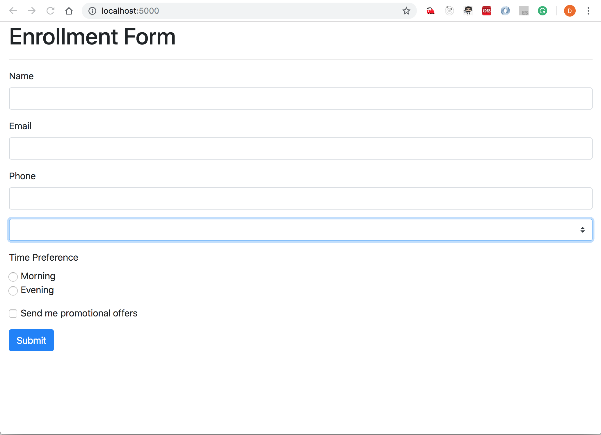
    <figcaption>&nbsp;&nbsp;&nbsp; Image - Bootstrap Registration Form</figcaption>
  </figure>
</p>

<hr/>

<p>
  <figure>
    &nbsp;&nbsp;&nbsp; 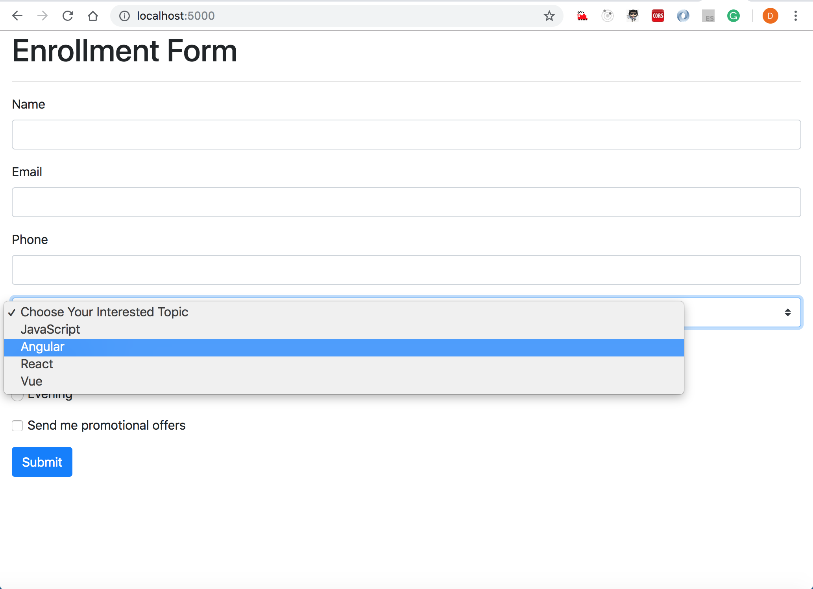
    <figcaption>&nbsp;&nbsp;&nbsp; Image - Bootstrap Registration Form with Drop Down Menu *ngFor</figcaption>
  </figure>
</p>

Angular Forms - 5 - Binding Data with ngForm
=====================
5.1. Angular Form - Key concepts:
---------------------
- **FormsModule**: Angluar template-driven forms are in their own module named `FormsModule`, to use the template driven form, we need to `explicitly import {FormsModule}` in our application module from `@angular/forms`

- **ngForm**: The `ngForm is an instance of the FormGroup`. The FormGroup represents the group of `FormControl` from HTML form tag, each form is a FormGroup because it will have at least one FormControl that gives us access to `(ngSubmit)` which can be bind to a method in our component and triggered when we submit the form. `The NgForm directive supplements the form element with additional features`. 

- **ngModel**: We need the `ngModel in the form input, and the input must be named too`. `[(ngModel)]` follows `[(banana in the box)]` syntax and performs `two-way binding` for reading and writing input control values. If a `[(ngModel)]` directive is used, the input field takes an initial value from the bound component class and updates it back whenever any change to the input control value is detected `(on keystroke and button press)`. 

- **ngModelGroup**: `ngModelGroup` is useful and helps to create group and sub-groups within forms like `ngModelGroup="address" -> and its sub child's like street, state, postal code, etc., ngModelGroup="person" -> and its sub child's name, age, gender, nationality etc.,` and so on

5.2. To start working with Angular Forms we need to follow some other steps:
---------------------
- In `app.module.ts` module class file 
    - import angular `FormsModule` and also include in `imports array`
- In file `app.component.html` the main markup file
    - As and When we use `form tag, angular attaches its inbuilt ngForm` directive to give/pass and manage valuable information of forms
    - `ngForm` directive denotes values of different fields/form-control and also values are valid or invalid

5.3. Template Reference Variable (TRF)
---------------------
- Template Reference Variable (TRF) is used to get the complete reference of the ngForm directive, we can use: `<form #userForm="ngForm">` 
    - Use interpolation to see/get form-control values entered: `{{ userForm.value | json }}` 
    - By default angular does not track each and every form-controls,  to track repsective field use `ngModel` directive with respective form field
    - Error will generate: <strong>*`ERROR Error: If ngModel is used within a form tag, either the name attribute must be set or the form control must be defined as 'standalone' in ngModelOptions`*</strong>
    - To resolve error we must need to use `name` attribute with every input form-control with `ngModel` : `<input type="text" class="form-control" name="userName" ngModel>`
        - Check the difference in `userForm.value` object
        - Enter data in every form field and again verify `userForm.value`
- We can collect and `send data to the server by using userForm.value` but the better approach is to bind data to `user defined model` and send model data to the server

> **Syntax & Example**: app.module.ts
```typescript
import { BrowserModule } from '@angular/platform-browser';
import { NgModule } from '@angular/core';
import { FormsModule } from '@angular/forms';

imports: [
    BrowserModule, 
    FormsModule
]
```

> **Syntax & Example**: app.component.html
```html
<div class="container-fluid">
    <h1>Enrollment Form</h1>
    <hr />

     <form #userForm="ngForm">

        <span class="lead"><strong>Forms Values : userForm.value :</strong></span> {{ userForm.value | json }} 
        <hr />

        <!-- name -->
        <div class="form-group">
            <label for="">Name</label>
            <input type="text" class="form-control" name="userName" ngModel>
        </div>

        <!-- email -->
        <div class="form-group">
            <label for="">Email</label>
            <input type="email" class="form-control" name="email" ngModel>
        </div>

        <!-- phone -->
        <div class="form-group">
            <label for="">Phone</label>
            <input type="tel" class="form-control" name="phone" ngModel>
        </div>

        <!-- user can select the topics bind with array -->
        <div class="form-group">
            <select class="custom-select" name="topic" ngModel>
            <option selected>Choose Your Interested Topic</option>
            <option *ngFor="let topic of topics">{{ topic }}</option>
            </select>
        </div>

        <!-- radio button group -->
        <div class="mb-3">
            <label for="">Time Preference</label>
            
            <div class="form-check">
            <input type="radio" class="form-check-input" name="timePreference" value="morning" ngModel>
            <label for="" class="form-check-label">Morning</label>
            </div>

            <div class="form-check">
            <input type="radio" class="form-check-input" name="timePreference" value="evening" ngModel> 
            <label for="" class="form-check-label">Evening</label>
            </div>

        </div>

        <!-- checkbox -->
        <div class="form-check mb-3">
            <input type="checkbox" class="form-check-input" name="subscribe" ngModel>
            <label for="" class="form-check-label">Send me promotional offers</label>
        </div>

        <!-- submit button -->
        <div>
            <button type="submit" class="btn btn-primary">Submit</button>
        </div>

    </form>

</div>
```

<p>
  <figure>
    &nbsp;&nbsp;&nbsp; 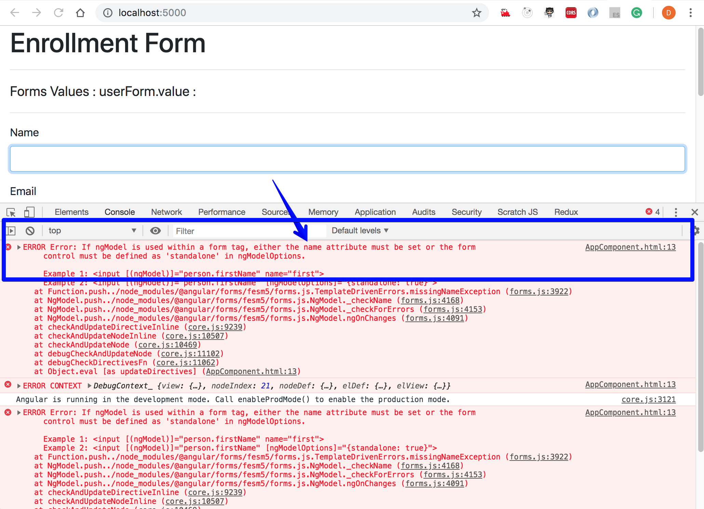
    <figcaption>&nbsp;&nbsp;&nbsp; Image - Template Driven Form - ngModel error</figcaption>
  </figure>
</p>

<hr/>

<p>
  <figure>
    &nbsp;&nbsp;&nbsp; 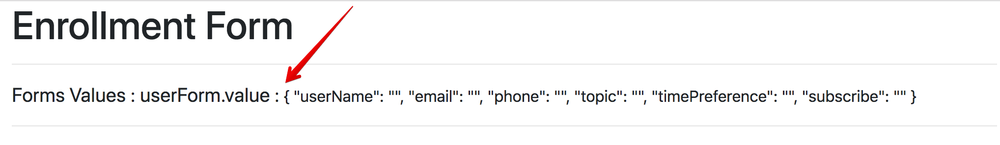
    <figcaption>&nbsp;&nbsp;&nbsp; Image - Form Model, FormControl/FormGroup - defualt values</figcaption>
  </figure>
</p>

<hr/>

<p>
  <figure>
    &nbsp;&nbsp;&nbsp; 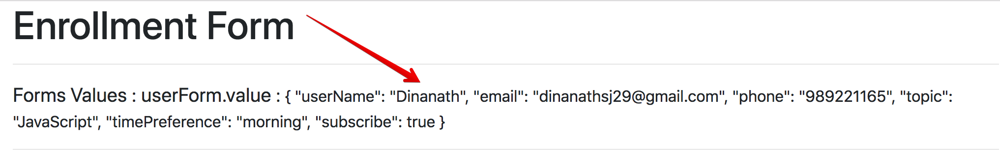
    <figcaption>&nbsp;&nbsp;&nbsp; Image - Form Model, FormControl/FormGroup - updated values</figcaption>
  </figure>
</p>

Angular Forms - 6 - Binding Data to a Model
=====================
- Here will try to create `user defined model`, as soon as user will enter data will update an instance of user model and send model data to the server
- Inside the app/project folder/directory generate a new class which acts as a model with the command: `ng generate class User` or `ng g class User` 
- It will generate a new file named: `user.ts`, type in the different `properties` of user class like `name, email, phone - as per fields used in the form`
- User model is ready with us now create an instance of model in `app.component.ts` with new property named `userModel` which consists of user default details/information: `userModel = new User('Dinanath', 'dinanathj@gmail.com', 9892221165, 'default', 'morning', true);`
- Custom userModel instance with data is ready in the class file now its time to `bind userModel with enrollment form using interpolation {{ userModel | JSON }}`
- To bind the userModel properties with form field use property binding denotes by a square bracket to the ngModel directive and userModel properties `[(ngModel)]="userModel.name"` and so on...
- `Property data binding by square bracket only is one-way data binding [(ngModel]` -> data flow from class to the view but not flows from view to the class
- So to implement/achieve two-way `data binding use banana in the box ie [(ngModel)]`, two-way data binding sync model and view

> **Syntax & Example**: user.ts
```typescript
export class User {
  constructor(
    public name: string,
    public email: string,
    public phone: number,
    public topic: string,
    public timePreference: string,
    public subscribe: boolean
  ){}
}
```

> **Syntax & Example**: app.component.ts
```typescript
import { User } from './user';

userModel = new User('Dinanath', 'dinanathj@gmail.com', 9892221165, 'default', 'morning', true);
```

> **Syntax & Example**: app.component.html
```html
<div class="container-fluid">
  <h1>Enrollment Form</h1>
  <hr />

  <form>

    <span class="lead"><strong>Forms Values : userForm.value :</strong></span> {{ userForm.value | json }} 
    <hr />

    <span class="lead"><strong>Forms Values : userModel data :</strong></span> {{ userModel | json }}
    <hr />

    <!-- name -->
    <div class="form-group">
      <label for="">Name</label>
      <!-- two way data binding used to update view and class both -->
      <input type="text" class="form-control" name="userName" [(ngModel)]="userModel.name">
    </div>

    <!-- email -->
    <div class="form-group">
      <label for="">Email</label>
      <input type="email" class="form-control" name="email" [(ngModel)]="userModel.email">
    </div>

    <!-- phone -->
    <div class="form-group">
      <label for="">Phone</label>
      <input type="tel" class="form-control" name="phone" [(ngModel)]="userModel.phone">
    </div>

    <!-- user can select the topics bind with array -->
    <div class="form-group">
      <select class="custom-select" name="topic" [(ngModel)]="userModel.topic">
      <option value="default">Choose Your Interested Topic</option>
      <option *ngFor="let topic of topics">{{ topic }}</option>
      </select>
    </div>

    <!-- radio button group -->
    <div class="mb-3">
      <label for="">Time Preference</label>
      
      <div class="form-check">
      <input type="radio" class="form-check-input" name="timePreference" value="morning" [(ngModel)]="userModel.timePreference">
      <label for="" class="form-check-label">Morning</label>
      </div>

      <div class="form-check">
      <input type="radio" class="form-check-input" name="timePreference" value="evening" [(ngModel)]="userModel.timePreference">
      <label for="" class="form-check-label">Evening</label>
      </div>

    </div>

    <!-- checkbox -->
    <div class="form-check mb-3">
        <input type="checkbox" class="form-check-input" name="subscribe" [(ngModel)]=userModel.subscribe>
        <label for="" class="form-check-label">Send me promotional offers</label>
    </div>

    <!-- submit button -->
    <div>
        <button type="submit" class="btn btn-primary">Submit</button>
    </div>

  </form>

</div>
```

<p>
  <figure>
    &nbsp;&nbsp;&nbsp; 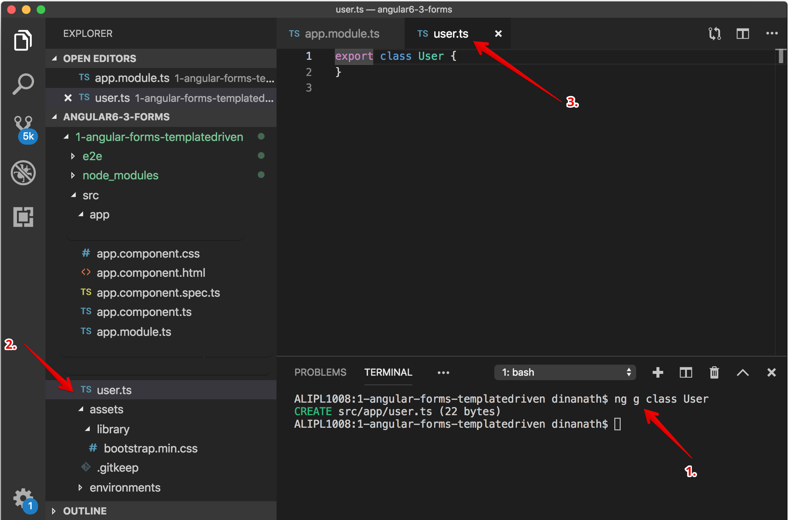
    <figcaption>&nbsp;&nbsp;&nbsp; Image - User Class - works as Data Model</figcaption>
  </figure>
</p>

<hr/>

<p>
  <figure>
    &nbsp;&nbsp;&nbsp; 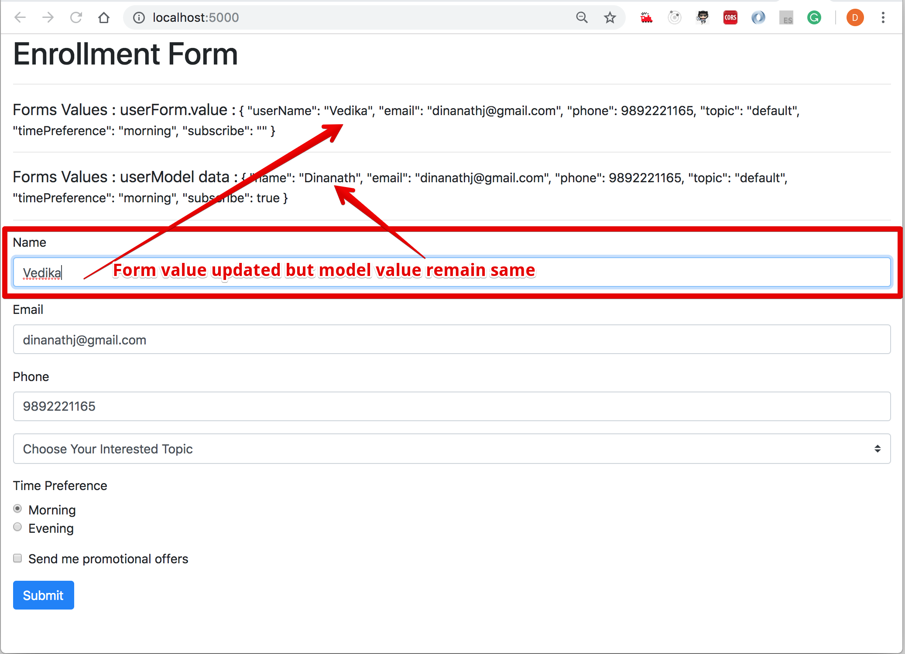
    <figcaption>&nbsp;&nbsp;&nbsp; Image - User Class - formvalue, modelvalue</figcaption>
  </figure>
</p>

<hr/>

<p>
  <figure>
    &nbsp;&nbsp;&nbsp; 
    <figcaption>&nbsp;&nbsp;&nbsp; Image - User Class, form model, Two Way Data Binding</figcaption>
  </figure>
</p>

Angular Forms - 7 - Tracking state and validity
=====================
- As Validations are an important aspect of programming, before sending data to the server it's pretty important to `validate the form data and show user respective visual feedback or error message`
- Using `ngModel` in a form gives you more than just two-way data binding:
    - It also tells you if the user touched the control (state & activity), 
    - If the value changed, or 
    - If the value became valid/invalid (validity)
- The `NgModel` directive doesn't just track state:
    - It updates the control with special `Angular CSS classes that reflect the state`,
    - We can leverage/utilize those class names to change the appearance of the control

7.1. Angular classes used to track control state and validity:
---------------------
Angular automatically attach classes like `ng-invalid, ng-dirty, ng-touched` to input fields

| STATE                                         | CLASS applied <br/> (if TRUE)   |  CLASS applied <br/> (if FALSE)     |
| ----------------------------------------------|-------------------|-----------------------|
| The control has been visited/clicked/touched  <br/> (`class will apply/change only on blur event`, user need to navigate away from form control)        | ng-touched        | ng-untouched          |
| The controls value has been changed  <br/> (class will apply when user type something)                                                                    | ng-dirty          | ng-pristine           |
| The controls value is valid                   | ng-valid          | ng-invalid            |

- Add a `#Template Reference Variable (#TRV)` named `#name` to the `Name <input> field` and use it to display the input's CSS classes
    - Use interpolation to see/get form-control classes: `{{ name.className }}` 
    - Right click on element and check in browser `inspect element` panel the respective angular state classes applied

> **Syntax & Example**: app.component.html (to apply state and class)
```html
<!-- name -->
<div class="form-group">
    <label for="">Name</label>
    <!-- two way data binding used to update view and class both -->
    <input type="text" #name required class="form-control" name="userName" [(ngModel)]="userModel.name">
</div>

<span class="text-primary"><strong>Angular Classes : name.className :</strong></span> {{ name.className }}
```

7.2. Angular classes and properties used to track control state and validity:
---------------------
- With each of the `state classes` angular also provide an alternative associated `state properties` on the ngModel directive
    - properties names are the same as the class name, only `ng-` removed from it

| CLASS                                     | PROPERTY                                  |
| ------------------------------------------|-------------------------------------------|
| .ng-untouched                              | untouched                                 |
| .ng-touched                                | touched                                   |
| .ng-pristine                               | pristine                                  |
| .ng-dirty                                  | dirty                                     |
| .ng-valid                                  | valid                                     |
| .ng-invalid                                | invalid                                   |

- `#name` reference variable by default point to input element/field of DOM, by assigning `#name="ngModel"` will `point to ngModel` so all ngModel properties will be available to us
    - Use interpolation to see/get form-control properties: `{{ name.touched }} {{ name.pristine }} {{ name.valid }}` 
    - Right click on element and check in browser `inspect element` panel the respective angular state classes applied with respective properties

> **Syntax & Example**: app.component.html (to apply state and properties)
```html
<!-- name -->
<div class="form-group">
    <label for="">Name</label>
    <!-- two way data binding used to update view and class both -->
    <input type="text" #name="ngModel" required class="form-control" name="userName" [(ngModel)]="userModel.name">
</div>

<span class="text-success"><strong>Angular ngModel properties used for input fields:</strong> touched - {{ name.touched }} <span class="text-warning">|</span> pristine - {{ name.pristine }} <span class="text-warning">|</span> valid - {{ name.valid }}</span>
```

<p>
  <figure>
    &nbsp;&nbsp;&nbsp; 
    <figcaption>&nbsp;&nbsp;&nbsp; Image - Form - State class - default</figcaption>
  </figure>
</p>

<hr/>

<p>
  <figure>
    &nbsp;&nbsp;&nbsp; 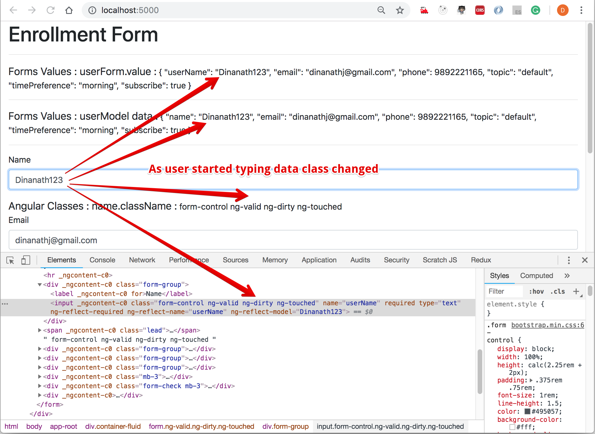
    <figcaption>&nbsp;&nbsp;&nbsp; Image - Form - State class - changed/upated/modified</figcaption>
  </figure>
</p>

<hr/>

<p>
  <figure>
    &nbsp;&nbsp;&nbsp; 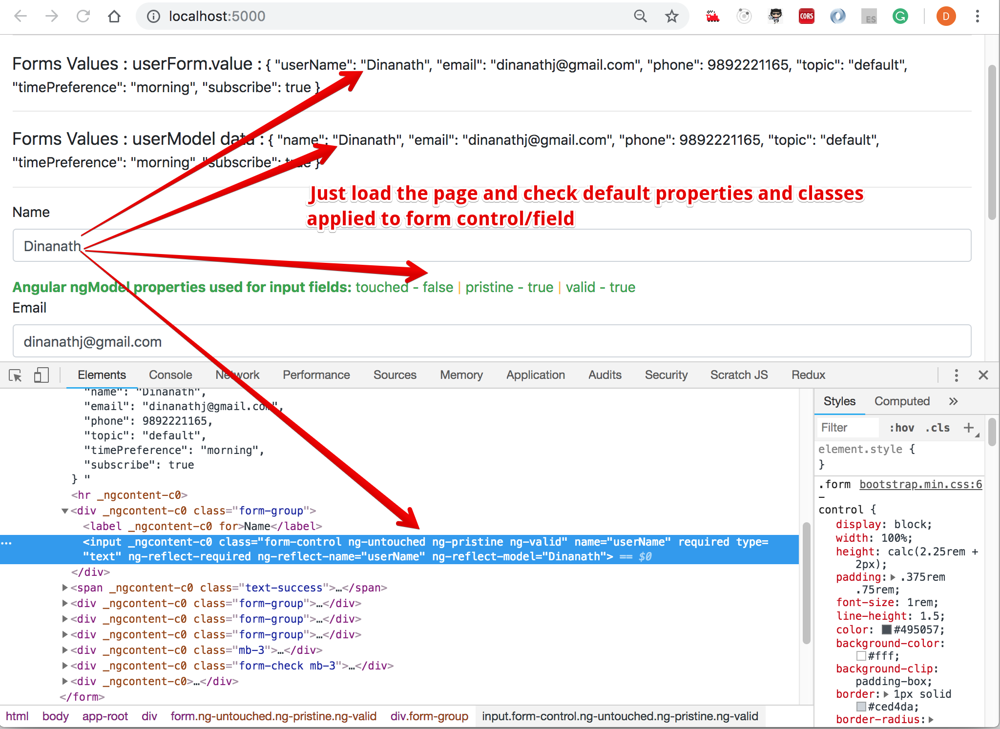
    <figcaption>&nbsp;&nbsp;&nbsp; Image - Form - State Properties - default</figcaption>
  </figure>
</p>

<hr/>

<p>
  <figure>
    &nbsp;&nbsp;&nbsp; 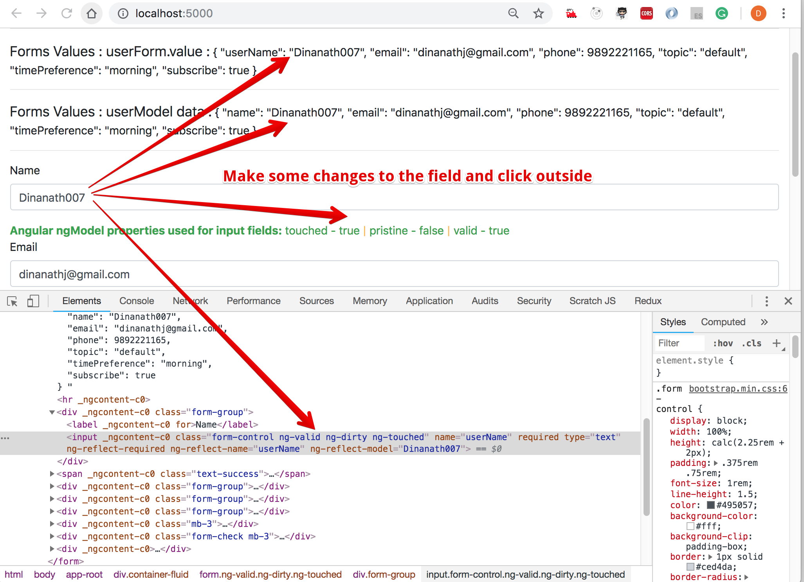
    <figcaption>&nbsp;&nbsp;&nbsp; Image - Form - State Properties - changed/upated/modified</figcaption>
  </figure>
</p>

Angular Forms - 8- Validation with Visual Feedback
=====================
- A good user experience is to visually indicate to the user `form field is valid/invalid` while feeling up the form/entering the details
- Usually one can use attributes/properties like `Required, Maxlength, Minlength and Pattern` for form validation on form input fields 
- We can use Angular inbuilt validation classes or can create a custom css class and use for indication

> **Note**: bootstrap uses a class `'is-invalid'` to show a red border around input fields

> **Syntax & Example**: styles.css
```css
/* create custom css class for indicating invalid visual border */
.form-control.ng-invalid.ng-touched {
  border: 1px solid coral;
  box-shadow: 1px 1px 5px 1px coral;
}
```

- Check if the name is `invalid` and also `touched` (something entered and removed) then only apply a bootstrap/custom class named `'is-invalid'` but don't apply initially without touch:
- Apply pattern matching validation input only `10 digits mobile number - pattern="^\d{10}$" `

> **Syntax & Example**: app.component.html (apply validation class to show red border)
```html
 <!-- name -->
<div class="form-group">
    <label for="">Name</label>
    <!-- two way data binding used to update view and class both -->
    <input type="text" #name="ngModel" required [class.is-invalid]="name.invalid && name.touched" class="form-control" name="userName" [(ngModel)]="userModel.name" placeholder="Name required*">
</div>

<!-- phone -->
<div class="form-group">
    <label for="">Phone</label>
    <input type="tel" #phone="ngModel" required pattern="^\d{10}$" [class.is-invalid]="phone.invalid && phone.touched"class="form-control" name="phone" [(ngModel)]="userModel.phone" placeholder="10 digits mobile number">
</div>
```

<p>
  <figure>
    &nbsp;&nbsp;&nbsp; 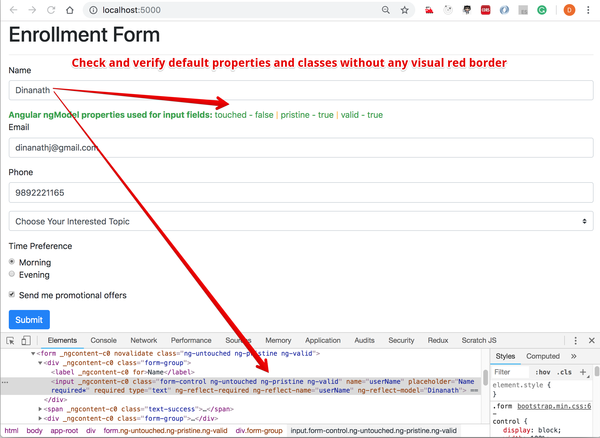
    <figcaption>&nbsp;&nbsp;&nbsp; Image - Form Default properties/class</figcaption>
  </figure>
</p>

<hr/>

<p>
  <figure>
    &nbsp;&nbsp;&nbsp; 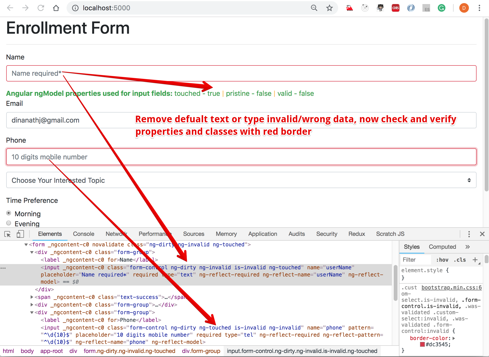
    <figcaption>&nbsp;&nbsp;&nbsp; Image - Form field - show Red border</figcaption>
  </figure>
</p>
