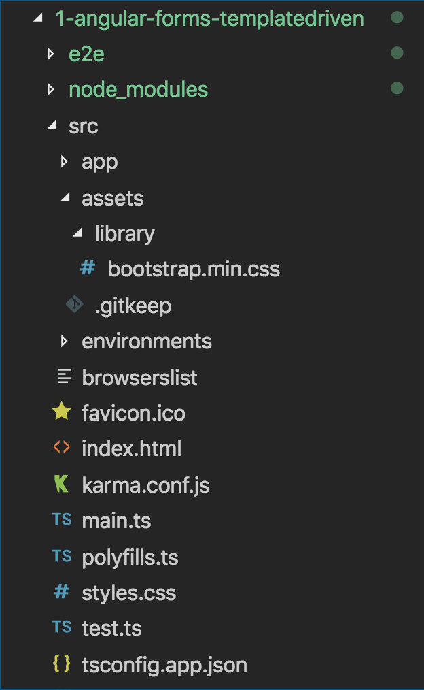

<p align="center">
  
</p>

Angular Template Driven Forms
=====================

Working with existing/cloned/copied Angular App
---------------------
- Clone or Download the project/app from Github or any other sources
- If using Visual Studio Code / Insiders, open Command panel/terminal from menu: View -> Terminal (shortcut key is `CTRL + BackTick` OR `COMMAND + J`)
- Go inside the project/app directory, command: `cd _examples-angular-templateDrivenForm OR cd templateDrivenForm`
- Run command: `npm install` to install project/app dependencies `(node_modules)`
- To Build and run Angular App, command: `ng serve / npm start` OR `ng serve -o` OR `ng serve --open`
- To change the port from 4200 to other port - type command:  `ng serve --port 5000`
- To check the application in browser type path/URL: `localhost:4200 / 5000`

1 - Angular Forms - Introduction
=====================
1.1. Introduction to forms in Angular
---------------------
- Forms are the main, critical building block of any modern front-end Web/Mobile application
- `The real objective of forms is gathering data`
- While dealing with Forms one should create an efficient and effective workflow, User Experience (UX) and User Interface (UI) which guide users properly
- In the context of Form, the Angular framework provides support for `two-way data binding, change tracking, validation, and error handling`

#### Forms are an important and vital part of any business applications, Forms are used to:
- Authentication
- Register / Login / Profile creation
- Submit request / Place an Order
- Pay Bills
- Schedule appointments
- Also to perform many other countless data entry operations/tasks

#### As Developers while dealing with Forms, we have to perform the following tasks:
- Data binding
- Change tracking
- Validation
- Visual feedback
- Error messages
- Form submission

1.2. Prerequisites to working with Angular Forms (Basic to Intermediate knowledge):
---------------------
Basic familiarity with HTML, CSS, and JavaScript, Angular 2/4/5/6 is a must. 

- HTML          - Markup
- CSS           - Style, Formates
- JavaScript    - Behaviour, Click, Validations
- Angular       - Templates, Components, Data Binding, Modules, Services, etc.
- TypeScript basics - Advanced JS features (Class, Arrow Function, Spread Operator)
- Text Editor / Visual Text Editors

1.3. Setup the Angular development environment:    
---------------------
In this section, we will learn how to set up a local development environment to start developing Angular apps. 

- `Node`, (website: https://nodejs.org/en) 
- `NPM`, (Node Package Manager - comes inbuilt with Node)
- `Angular CLI = Command Line Interface`, Angular CLI (Command Line Interface) for angular (website:  https://cli.angular.io/), 
    - The quickest and easiest way of starting an Angular app is through the `Angular CLI (Command Line Interface)`. It allows/helps the developer to build/generate building blocks of angular application like component, services, routings, modules, etc. with best practices quicker and easier)
- `Text Editor`
    - Visual Studio Code / Visual Studio Code Insiders (website: https://code.visualstudio.com)
    - Sublime Text, 
    - Atom, 
    - Brackets etc.

1.4. Anatomy / Mechanism / Concept behind Angular Forms:
---------------------
Component Template Markup `(.HTML view - Collects data)` -> Class `(.TS - Binds Data)` -> Services `(.TS Send Data)` -> Server

1.5. Angular Forms Types/techniques/strategies/approaches:
---------------------
1. **Template Driven Forms**: 
    - Primarily depends on the component template (manual HTML)
    - Most of the code written in the component (.HTML) template file
    - Template-driven forms are useful for adding a simple form to an app, such as an email list, signup form, etc.
2. **Reactive Model Driven Forms**: 
    - Primarily depends on the component class (dynamic)
    - Majority of code written in component .ts class file
    - Reactive forms are more robust, scalable, reusable, and testable
    
2 - Angular Template Driven Forms (TDFs)
=====================
In Template Driven forms, most of the logic/code resides in the .HTML/view/template file. The template is responsible for setting up the form, the validation, control, group etc. 

2.1 Template Driven Forms (TDFs) - what is it all about?
---------------------
- Template Driven Forms (TDFs) are easy to use and similar to AngularJs (Angular 1.x) forms
- TDFs are mainly/heavily relay and depends on `Two Way Data Binding`
- The `ngModel` directives take care of actual input field values and data changes
- TDFs most of the code is a manual template, so it consists of bulky (.HTML) code/markups and minimal component code
- `ngForm` directive along with `ngModel` directive automatically tracks the form and form elements state & validity

2.2 Drawback of TDF
---------------------
- `Unit testing` is the biggest challenge (we need to run `End2End test (e2e)` with browser)
- Due to heavy markup in the template, `readability decreases and markup code looks complex`
- TDFs are `suitable for simple scenarios` only, Reactive forms are used for complex validations, unit test validations       

2.3 Steps to create and use Template Driven Forms (TDFs):
---------------------
1. Create/generate new Angular CLI project
2. Add a form HTML/markup
3. Binding the Data (`ngForm` and `ngModel` directives)
4. Tracking state and validity (Add validation using `built-in validators`)
5. Providing visual Feedback (Display meaningful messages-feedbacks)
6. Displaying error messages (Display validation errors)
7. Posting data to server/`express server` (Handle form submission using `ngSubmit`)

3 - Setting up new Angualr project
=====================
1. First check `angular cli` installed version details on machine by using command at command prompt: `ng -v` or `ng --version`

<p>
  <figure>
    &nbsp;&nbsp;&nbsp; 
    <figcaption>&nbsp;&nbsp;&nbsp; Image - Angular CLI version</figcaption>
  </figure>
</p>

2. If `angular cli` not installed/available on machine (no version or error message displayed) then install it by using the command: `npm install -g @angular/cli@latest`
3. To `update/upgrade angular cli` to the latest version, use following commands in sequence:
    - command: `npm uninstall -g @angular/cli`
    - command: `npm cache verify or npm cache clean`
    - command: `npm install -g @angular/cli@latest`
4. Generate/create a new Angular app/project with Angular CLI - for dealing with angular forms with the syntax: `ng new appName` or `ng new project-name`, command: `ng new angular-forms-templatedriven` (after creation check the newly generated folder structure)

<p>
  <figure>
    &nbsp;&nbsp;&nbsp; 
    <figcaption>&nbsp;&nbsp;&nbsp; Image - Angular project/app folder structure</figcaption>
  </figure>
</p>

5. To run/serve the application, at command prompt type command: `ng serve` or `ng serve --port 5000` (change the port number)
6. Go to the browser and load the application by typing address: `http://localhost:4200/` or `http://localhost:5000/`
7. Add the `Bootstrap` framework to an application (CSS framework used to make cool/intuitive User Interface and look/feel)
    - Download bootstrap css to local machine from bootstrap website: https://getbootstrap.com/docs/4.1/getting-started/download/ into folder `assets/library/bootstrap.min.css`
    - Include bootstrap in application - index.html under `head` tag - `<link rel="stylesheet" href="./assets/library/bootstrap.min.css" integrity="sha384-MCw98/SFnGE8fJT3GXwEOngsV7Zt27NXFoaoApmYm81iuXoPkFOJwJ8ERdknLPMO" crossorigin="anonymous" />`
    - or you can include a `CDN` path in index.html under head tag
    - or else you can install bootstrap with npm command: `npm install bootstrap` and use it

<p>
  <figure>
    &nbsp;&nbsp;&nbsp; 
    <figcaption>&nbsp;&nbsp;&nbsp; Image - Bootstrap website - installation options</figcaption>
  </figure>
</p>

8. To verify bootstrap included/working properly in an application, check in Browser fonts, etc changed or not?
    - Also in `app.component.html` just create any simple component like buttons or divs with bootstrap class: 
        - `<button class="btn btn-success">Success Button</button>`  or 
        - `<div class="lead">Lead Heading</div>`
        - Right click on element and check in `inspect element` the bootstrap class and properties applied to respective elements

> **Syntax & Example**: index.html
```html
<!doctype html>
<html lang="en">

  <head>
    <meta charset="utf-8">
    <title>TemplateDrivenForms</title>
    <base href="/">

    <meta name="viewport" content="width=device-width, initial-scale=1">
    <link rel="icon" type="image/x-icon" href="favicon.ico">
    <link rel="stylesheet" href="./assets/library/bootstrap.min.css" integrity="sha384-MCw98/SFnGE8fJT3GXwEOngsV7Zt27NXFoaoApmYm81iuXoPkFOJwJ8ERdknLPMO" crossorigin="anonymous" />
  </head>

  <body>

    <app-root> </app-root>

  </body>

</html>
```

